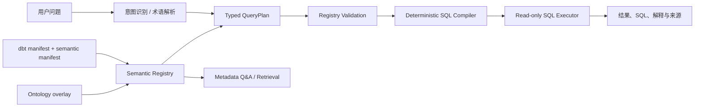

# Data Agent · dbt + Ontology Hybrid

[English README](README_EN.md) · [架构设计](docs/architecture.md) · [Semantic Registry 与 QueryPlan](docs/semantic-registry.md)

> 一个面向 Chat BI / Data Agent 的研究型作品：用 **dbt** 管理可信的数据语义，用 **Ontology** 表达业务对象与关系，再把自然语言问题收敛为可验证的查询计划和确定性 SQL。


## 这是什么

大多数 Text-to-SQL 系统把表结构直接交给模型，再希望模型“猜对”指标口径与 JOIN。这个项目探索另一条路径：

1. dbt 负责数据模型、指标、维度、测试与血缘；
2. Ontology 负责业务对象、关系、基数、业务别名与展示语义；
3. LLM 只负责理解问题并生成受约束的 `QueryPlan`；
4. 后端验证计划并用确定性编译器生成 SQL；
5. 只读执行器返回结果、来源与解释。

这不是一个“让 LLM 随意写 SQL”的 demo，而是一个围绕 **semantic contract、query planning、controlled compilation** 的 Data Agent 原型。

## 我想验证的命题

> 当指标、对象和关系拥有统一语义契约时，LLM 可以从 SQL 生成者降级为计划生成者；查询的正确性、可审计性和可维护性因此更接近传统数据产品的标准。

项目重点不是替代 dbt，而是补足 dbt Semantic Layer 在跨业务对象关系、实体视角分析和 Agent 规划上的表达能力。

## 核心架构



运行时只有三种受支持模式：

| 模式 | 用途 | SQL 来源 |
|---|---|---|
| `metric_analysis` | 指标、维度、时间范围与筛选 | 由 metric compiler 从 dbt 语义编译 |
| `entity_analysis` | 对象属性、跨对象关系、明细筛选 | 由 entity compiler 从 Ontology 路径编译 |
| `metadata_qa` | 指标口径、字段定义、模型和关系说明 | 不执行 SQL，直接检索元数据 |

开放式问题不会直接进入 Text-to-SQL；它必须先生成并通过验证的 JSON `QueryPlan`。因此 LLM 不被允许编造表、列或 JOIN。

## 当前实现

### dbt 语义与示例数据域

项目内置一个电商分析样例，包含：

- 5 个 semantic models：orders、customers、inventory、marketing、customers RFM；
- 28 个指标，覆盖营收、订单、库存、营销、RFM；
- 8 个 Ontology object types 和 6 条显式关系；
- staging → marts 的 dbt 模型、种子数据和模型测试；
- 指标级时间过滤、指标过滤和 Data Agent 扩展的比率指标公式。

### Semantic Registry

[`SemanticRegistry`](backend/semantic/registry.py) 在启动时合并 dbt artifacts 与 `ontology.yml`，并校验：

- Ontology 对象是否映射到存在的 dbt relation；
- 对象属性、主键、时间字段和 relationship join key 是否存在；
- 业务属性与物理字段的映射是否显式，例如 `Order.customer_city → fact_orders.city`；
- metric、dimension、measure 和默认时间字段是否可解析。

`dbt parse` 后可生成可检查的 `dbt_project/target/semantic_registry.json`：

```powershell
.\venv\Scripts\python.exe scripts\build_semantic_registry.py
```

### QueryPlan 与编译器

LLM / Router 输出的是受 Pydantic 约束的计划，而不是 SQL：

```json
{
  "mode": "entity_analysis",
  "root_entity": "InventoryRecord",
  "selections": [
    {"entity": "InventoryRecord", "property": "quantity_on_hand"},
    {"entity": "Product", "property": "product_name"}
  ],
  "relationships": [
    {"relationship": "tracks", "from_entity": "InventoryRecord", "to_entity": "Product"}
  ],
  "filters": [
    {"field": "needs_reorder", "operator": "eq", "value": true}
  ]
}
```

编译器支持：

- 单模型指标、时间窗口、维度分组和指标级过滤；
- 比率指标（例如 AOV、Campaign ROI）的分子/分母编译；
- 跨模型的标量指标：先在各自粒度预聚合，再 `CROSS JOIN`，避免事实表 fan-out；
- 正向与反向关系路径；
- 去范式关系复用同一表别名，不产生无意义 self join；
- 对计划中的字段、对象、操作符和路径进行 Registry 白名单验证。

更完整的设计说明见 [Architecture](docs/architecture.md)。

## 为什么是 dbt + Ontology

| 问题 | 仅依赖 dbt 语义 | 本项目的补充 |
|---|---|---|
| KPI、维度与时间口径 | 强项 | 直接复用 dbt artifacts |
| 跨对象业务问题 | 需要依赖物理模型或提示词猜测 | 显式 Object / Relationship graph |
| LLM 输出控制 | 通常直接生成 SQL | LLM 生成 QueryPlan，后端编译 SQL |
| JOIN 正确性 | 依赖模型推理 | join key、方向与基数由 Ontology 约束 |
| 语义变更 | 文档、代码与 prompt 容易漂移 | Registry 在启动和 CI 中验证契约 |

## 技术栈

| 层 | 选择 | 作用 |
|---|---|---|
| 建模与语义 | dbt Core + PostgreSQL | marts、metrics、dimensions、测试、manifest |
| 业务关系 | YAML Ontology overlay | 对象、属性、关系、基数、去范式标记 |
| 服务端 | FastAPI + SSE | 流式查询状态与 API |
| 查询规划 | Pydantic + OpenAI-compatible LLM | Typed QueryPlan、意图识别、结果解释 |
| SQL | 自定义 deterministic compiler + SQLAlchemy | 从已验证计划生成并执行只读 SQL |
| 前端 | Streamlit + pyecharts | 对话、结果表、图表与 Ontology 浏览 |

## 快速开始

### 前置条件

- Python 3.12+
- PostgreSQL 16+，或 Docker Compose
- 一个 OpenAI-compatible LLM API（DeepSeek、OpenAI 等）

### 本地运行

```powershell
git clone https://github.com/QDD518/data-agent-dbt-hybrid.git
cd data-agent-dbt-hybrid

python -m venv venv
.\venv\Scripts\activate
pip install -r requirements-dev.txt

Copy-Item .env.example .env
# 编辑 .env：配置 LLM 与 PostgreSQL 连接

cd dbt_project
dbt seed
dbt run
dbt parse
cd ..
.\venv\Scripts\python.exe scripts\build_semantic_registry.py

.\venv\Scripts\python.exe -m backend.main
# 新终端：.\venv\Scripts\streamlit.exe run frontend/app.py
```

服务启动后：

- API: `http://localhost:8000`
- UI: `http://localhost:8501`
- API metadata: `GET /api/metadata`

### Docker Compose

```bash
docker compose up --build
```

Compose 会先创建 PostgreSQL、执行 `dbt seed/run/parse` 与 Semantic Registry 构建，再启动 API 和前端。

## 测试

测试覆盖 Registry 契约、QueryPlan 校验、指标/关系编译、SSE 编排、SQL 安全与可选数据库执行验证。

```powershell
# 不依赖 PostgreSQL 的测试
.\venv\Scripts\python.exe -m pytest -p no:cacheprovider -q

# dbt build 和 PostgreSQL 已就绪后，执行真实数据库验证
$env:RUN_DB_INTEGRATION = '1'
.\venv\Scripts\python.exe -m pytest -p no:cacheprovider -m integration -q
```

## 项目结构

```text
backend/
  agent/        # intent router、QueryPlan planner、SSE orchestration
  semantic/     # registry、typed plans、deterministic compiler
  ontology/     # ontology parser 与兼容的 graph traversal engine
  metadata/     # dbt artifact parser
  sql/          # read-only executor 与 SQL safety checks
dbt_project/
  models/       # staging、marts、semantic models、metrics、ontology overlay
  seeds/        # 电商示例数据
docs/
  architecture.md        # 完整架构与关键设计决策
  semantic-registry.md  # Registry / QueryPlan 参考
tests/          # unit、SSE 与可选 DB integration tests
```

## 项目边界与下一步

这是一个主动追求正确性与可解释性的原型，尚未宣称为生产级 Data Agent。生产化前仍需要：

- 数据库级 RBAC / RLS、身份认证与审计；
- SQL AST 校验、参数绑定、成本治理与限流；
- 真实业务语料的 golden set、自动化评测和 CI；
- 更丰富的 Ontology 建模、歧义澄清和数据新鲜度治理；
- 可插拔的数据源与多租户语义隔离。

这些限制是刻意公开的：它们也是我希望继续在 Data Agent、语义层和可信分析系统方向深入的工程问题。

## 这个作品展示了什么

- 将 dbt、知识图谱式对象关系与 LLM Agent 组合为可验证的数据产品架构；
- 从“LLM 生成 SQL”转向“LLM 生成计划、系统生成 SQL”的可靠性设计；
- 对数据粒度、fan-out、指标公式、关系方向与语义漂移的工程化处理；
- API、流式交互、数据建模、测试和部署编排的端到端实现。

## License

MIT License. See [LICENSE](LICENSE).
