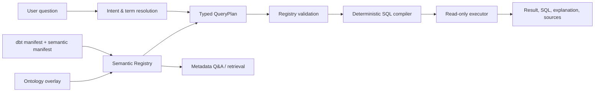

# Data Agent · dbt + Ontology Hybrid

[中文 README](README.md) · [Architecture](docs/architecture.md) · [Semantic Registry & QueryPlan](docs/semantic-registry.md)

> A research-oriented Chat BI / Data Agent prototype that combines **dbt semantic metadata**, a lightweight **business ontology**, and a **validated query-planning pipeline** to produce deterministic, inspectable SQL.


## Why this project

Many Text-to-SQL systems expose a database schema to an LLM and expect it to
infer metric definitions, table grain, and valid joins. This project explores a
more controlled alternative:

1. **dbt** owns physical models, metrics, dimensions, tests, and lineage.
2. An **Ontology overlay** owns business entities, relationships, cardinality,
   aliases, and presentation metadata.
3. An LLM may interpret a question, but it produces a typed **QueryPlan**, not
   executable SQL.
4. The backend validates that plan against a canonical semantic registry.
5. A deterministic compiler generates read-only PostgreSQL SQL.

The result is not a “prompt the model to write SQL” demo. It is a portfolio
prototype for exploring semantic contracts, query planning, and controlled
compilation in data agents.

## The hypothesis

> If metrics, entities, and relationships are expressed as one semantic
> contract, an LLM can act as a planner rather than a SQL author. Correctness,
> auditability, and maintainability can then move closer to conventional data
> product standards.

The project does not replace dbt. It extends dbt's semantic assets with an
object-and-relationship view that is useful for entity-oriented analysis and
agent planning.

## Architecture



There are three supported runtime modes:

| Mode | Purpose | SQL source |
|---|---|---|
| `metric_analysis` | Metrics, dimensions, time windows, filters | Compiled from dbt semantic metadata |
| `entity_analysis` | Entity attributes, relationships, detail filters | Compiled from validated ontology paths |
| `metadata_qa` | Definitions, lineage, fields, metrics, relationships | No data SQL is executed |

An open-ended request is not allowed to execute raw Text-to-SQL. It must first
become a valid JSON `QueryPlan`; unknown tables, columns, and joins are rejected
by the registry.

## What is implemented

### dbt semantic domain

The repository includes an e-commerce analytics example with:

- 5 semantic models: orders, customers, inventory, marketing, and customer RFM;
- 28 metrics across revenue, orders, inventory, marketing, and RFM analysis;
- 8 ontology object types and 6 explicit relationships;
- dbt staging/mart models, seeds, and tests;
- metric-level filters, time windows, and Data Agent ratio formulas.

### Semantic Registry

[`SemanticRegistry`](backend/semantic/registry.py) combines dbt artifacts with
`ontology.yml` and validates the runtime semantic contract:

- every ontology object maps to an existing dbt relation;
- properties, primary keys, time dimensions, and join keys exist;
- business-to-physical mappings are explicit, e.g.
  `Order.customer_city → fact_orders.city`;
- metric, dimension, measure, and default-time metadata can be resolved.

After `dbt parse`, generate an inspectable artifact with:

```powershell
.\venv\Scripts\python.exe scripts\build_semantic_registry.py
```

### Typed planning and deterministic compilation

The planner returns a constrained representation instead of SQL:

```json
{
  "mode": "entity_analysis",
  "root_entity": "InventoryRecord",
  "selections": [
    {"entity": "InventoryRecord", "property": "quantity_on_hand"},
    {"entity": "Product", "property": "product_name"}
  ],
  "relationships": [
    {"relationship": "tracks", "from_entity": "InventoryRecord", "to_entity": "Product"}
  ],
  "filters": [
    {"field": "needs_reorder", "operator": "eq", "value": true}
  ]
}
```

The compiler supports:

- single-model metrics, grouping, time windows, and metric-level filters;
- ratio metrics such as AOV and campaign ROI;
- cross-model scalar metrics through independent pre-aggregation CTEs, avoiding
  fact-table fan-out;
- forward and reverse entity relationships;
- denormalized relationships without redundant self-joins;
- registry allow-list validation for fields, entities, operators, and paths.

See [docs/architecture.md](docs/architecture.md) for the detailed design.

## Why dbt + Ontology

| Concern | dbt semantic metadata | Ontology extension in this project |
|---|---|---|
| Metrics, dimensions, time semantics | Core strength | Reused directly from dbt artifacts |
| Cross-object business questions | Often pushed into physical models or prompts | Explicit entity / relationship graph |
| LLM output control | Usually application-defined | Typed QueryPlan; backend compiles SQL |
| Join correctness | Can depend on model inference | Explicit keys, direction, and cardinality |
| Semantic drift | Docs, prompts, and code can diverge | Registry validates the combined contract |

## Stack

| Layer | Choice | Role |
|---|---|---|
| Modeling | dbt Core + PostgreSQL | Marts, metrics, dimensions, tests, manifests |
| Business graph | YAML ontology overlay | Entities, properties, relationships, cardinality |
| Backend | FastAPI + SSE | API and streaming query lifecycle |
| Planning | Pydantic + OpenAI-compatible LLM | Typed planning, routing, result interpretation |
| SQL | Deterministic compiler + SQLAlchemy | Validated SQL generation and read-only execution |
| UI | Streamlit + pyecharts | Chat, results, charts, ontology exploration |

## Quick start

### Prerequisites

- Python 3.12+
- PostgreSQL 16+, or Docker Compose
- An OpenAI-compatible LLM API (DeepSeek, OpenAI, and similar providers)

### Local setup

```powershell
git clone https://github.com/QDD518/data-agent-dbt-hybrid.git
cd data-agent-dbt-hybrid

python -m venv venv
.\venv\Scripts\activate
pip install -r requirements-dev.txt

Copy-Item .env.example .env
# Configure the LLM and PostgreSQL connection in .env

cd dbt_project
dbt seed
dbt run
dbt parse
cd ..
.\venv\Scripts\python.exe scripts\build_semantic_registry.py

.\venv\Scripts\python.exe -m backend.main
# In a second terminal: .\venv\Scripts\streamlit.exe run frontend/app.py
```

Endpoints:

- API: `http://localhost:8000`
- UI: `http://localhost:8501`
- Metadata: `GET /api/metadata`

### Docker Compose

```bash
docker compose up --build
```

Compose starts PostgreSQL, builds dbt models and artifacts, generates the
semantic registry, then starts the API and frontend.

## Tests

The test suite covers registry contract validation, QueryPlan validation,
metric/entity compilation, SSE orchestration, SQL safety, and optional database
execution checks.

```powershell
# Hermetic tests; no PostgreSQL required
.\venv\Scripts\python.exe -m pytest -p no:cacheprovider -q

# After dbt build and PostgreSQL are available
$env:RUN_DB_INTEGRATION = '1'
.\venv\Scripts\python.exe -m pytest -p no:cacheprovider -m integration -q
```

## Repository map

```text
backend/
  agent/        # routing, QueryPlan planner, SSE orchestration
  semantic/     # registry, typed plans, deterministic compiler
  ontology/     # parser and compatibility graph traversal engine
  metadata/     # dbt artifact parser
  sql/          # read-only executor and SQL safety checks
dbt_project/
  models/       # staging, marts, semantic models, metrics, ontology overlay
  seeds/        # e-commerce example data
docs/
  architecture.md        # full architecture and decisions
  semantic-registry.md  # Registry / QueryPlan reference
tests/          # unit, SSE, and optional DB integration tests
```

## Scope and next steps

This is intentionally an honest prototype, not a production-ready data agent.
The most important next steps are:

- database RBAC/RLS, authentication, and audit trails;
- SQL AST validation, parameter binding, cost governance, and rate limiting;
- business-domain golden sets, automated evaluation, and CI;
- richer ontology modeling, ambiguity resolution, and freshness governance;
- pluggable data sources and multi-tenant semantic isolation.

Making these boundaries explicit is part of the portfolio value: they are the
engineering problems I want to keep exploring in data agents, semantic layers,
and trustworthy analytical systems.

## What this portfolio project demonstrates

- A verifiable data-agent architecture spanning dbt, ontology modeling, LLM
  planning, SQL compilation, APIs, UI, and tests.
- The shift from “LLM writes SQL” to “LLM proposes a plan; the system writes
  SQL”.
- Engineering treatment of metric formulas, relationship direction, table grain,
  fan-out, and semantic drift.
- An end-to-end implementation rather than a prompt-only proof of concept.

## License

MIT License. See [LICENSE](LICENSE).
