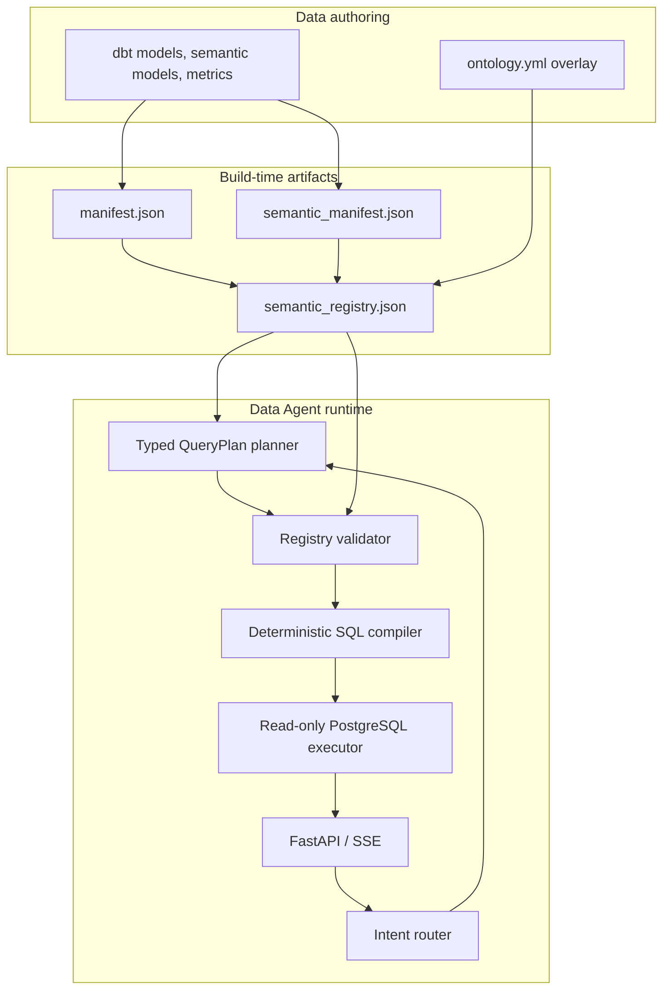
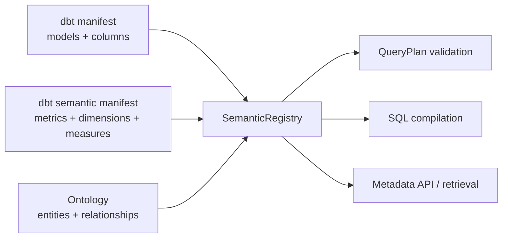
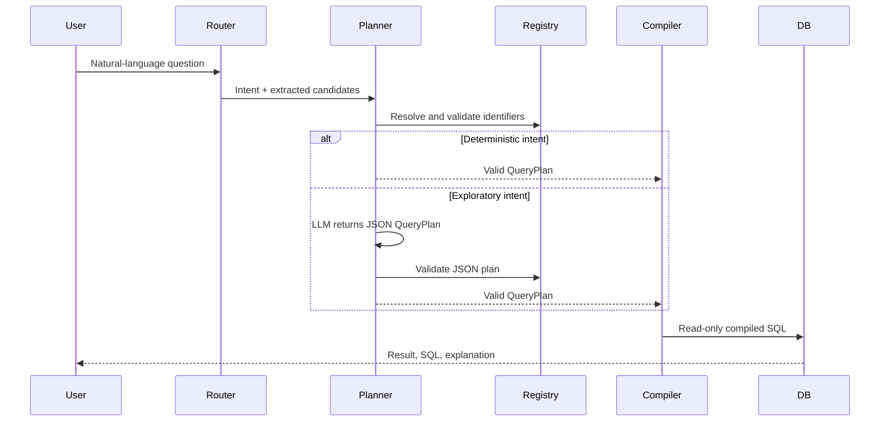

# Architecture: dbt + Ontology + QueryPlan

## 1. Problem statement

Natural-language analytics has two different failure modes:

1. **Semantic errors**: the answer uses the wrong metric formula, time field,
   table grain, or business definition.
2. **Relational errors**: the query invents a join, traverses it in the wrong
   direction, or multiplies facts through a fan-out.

Giving raw schemas to an LLM does not solve either problem reliably. This
project treats the LLM as a constrained planner and moves semantic validation
and SQL generation into deterministic application code.

## 2. Design principles

| Principle | Consequence |
|---|---|
| dbt remains the physical and metric authority | Runtime metadata is built from dbt artifacts, not handwritten SQL prompts |
| Ontology is an overlay, not another warehouse model | It adds entities, relationships, cardinality, aliases, and presentation metadata |
| Plans are data; SQL is a compiled artifact | The LLM returns JSON `QueryPlan`, never executable SQL |
| Validate before compiling | Identifiers, paths, properties, filters, and time ranges are checked against a Registry |
| Prefer explicit limits over plausible guesses | Unsupported cross-model dimensional analysis is rejected instead of silently fan-out joining |

## 3. System context



The persisted registry artifact is primarily for inspection and deployment
visibility. At runtime the service rebuilds the in-memory Registry from current
dbt metadata plus the ontology overlay, so startup detects contract drift.

## 4. Semantic sources and ownership

### dbt owns

- physical relations, source-to-mart transformations, and table grain;
- semantic models, dimensions, measures, metrics, and default time dimensions;
- model tests and generated manifests;
- metric filters and Data Agent metric extensions stored as dbt `config.meta`.

### Ontology owns

- business-facing object types such as `Order`, `Product`, and
  `InventoryRecord`;
- property names and explicit physical-column mappings;
- relationship names, join keys, cardinality, and denormalization markers;
- descriptions and UI metadata.

An ontology object does not need to duplicate a physical model. For example,
`InventoryRecord` and `Warehouse` can refer to one denormalized inventory mart.
The `stored_in` relationship records that this is a semantic relationship but
not a physical join.

## 5. Semantic Registry

`backend/semantic/registry.py` creates the canonical in-memory contract.



Registry validation fails fast when an ontology relation, property, primary key,
time dimension, or join key no longer exists in dbt metadata. It also supports a
business-property-to-physical-column mapping. This prevents common drift such as
describing `customer_city` while the mart column is physically named `city`.

The build command is:

```powershell
dbt parse
..\venv\Scripts\python.exe ..\scripts\build_semantic_registry.py
```

See [semantic-registry.md](semantic-registry.md) for the operational reference.

## 6. QueryPlan contract

The runtime accepts three discriminated Pydantic plans.

### Metric analysis

```json
{
  "mode": "metric_analysis",
  "metrics": ["total_revenue"],
  "dimensions": ["product_category"],
  "filters": [],
  "time_range": "last_month",
  "limit": 1000
}
```

Validation ensures that requested metrics belong to the same semantic model when
dimensions or user filters are present. A scalar request can include metrics
from several models, because each is safely pre-aggregated before being combined.

### Entity analysis

```json
{
  "mode": "entity_analysis",
  "root_entity": "InventoryRecord",
  "selections": [
    {"entity": "InventoryRecord", "property": "quantity_on_hand"},
    {"entity": "Product", "property": "product_name"}
  ],
  "relationships": [
    {"relationship": "tracks", "from_entity": "InventoryRecord", "to_entity": "Product"}
  ],
  "filters": [
    {"field": "needs_reorder", "operator": "eq", "value": true}
  ]
}
```

Each relationship step must originate at an entity already present in the plan.
Cycles, unknown properties, and properties outside the path are rejected.
Legacy router output with unqualified properties is resolved to explicit entity
selections before compilation; ambiguous names require a clearer plan.

### Metadata Q&A

```json
{
  "mode": "metadata_qa",
  "question": "How is total revenue calculated?"
}
```

This mode retrieves dbt and ontology documentation only. It does not execute a
business-data query.

## 7. Planning flow



The LLM fallback prompt contains Registry names, not arbitrary database schema
instructions. If its response is raw SQL or invalid JSON, planning stops.

## 8. SQL compilation rules

`backend/semantic/compiler.py` has two compilers under one validation model.

### Metric compiler

- resolves metrics to a dbt semantic model and physical relation;
- applies metric-level filters inside aggregate expressions;
- uses the semantic model's `agg_time_dimension` for time windows;
- supports ratio formulas defined in Data Agent metadata;
- emits a `GROUP BY` only for requested dimensions.

For example, a filtered revenue metric compiles conceptually to:

```sql
SELECT
  SUM(CASE WHEN status = 'Completed' THEN net_amount END) AS total_revenue
FROM analytics_analytics.fact_orders
WHERE order_date >= date_trunc('month', CURRENT_DATE) - interval '1 month'
  AND order_date < date_trunc('month', CURRENT_DATE)
LIMIT 1000
```

### Cross-model scalar metrics

Cross-model detail joins are a common source of incorrect aggregates. For a
scalar request such as revenue plus total stock, the compiler keeps each metric
at its native grain:

```sql
WITH
  m0 AS (... aggregate revenue from orders ...),
  m1 AS (... aggregate stock from inventory ...)
SELECT m0.total_revenue, m1.total_stock_quantity
FROM m0
CROSS JOIN m1
```

This is deliberate. Cross-model dimensions or filters require an explicit
entity analysis plan rather than a guessed join.

### Entity compiler

- resolves a declared forward or reverse relationship path;
- uses declared source/target join keys only;
- reuses the source alias for denormalized relationships;
- validates every selected and filtered property against its entity;
- emits a bounded `LIMIT`.

The legacy graph traversal engine remains for compatibility and unit coverage,
but the API execution path uses the unified compiler.

## 9. Runtime modules

| Module | Responsibility |
|---|---|
| `backend/metadata/parser.py` | Reads dbt manifests and current source metadata |
| `backend/ontology/parser.py` | Loads ontology objects, property mappings, and relationships |
| `backend/semantic/registry.py` | Builds and validates the combined semantic contract |
| `backend/semantic/query_plan.py` | Defines and validates typed plans |
| `backend/agent/planner.py` | Converts router output or LLM JSON into a valid plan |
| `backend/semantic/compiler.py` | Compiles metric and entity plans to SQL |
| `backend/agent/orchestrator.py` | Streams classification, plan, SQL, result, and interpretation events |
| `backend/sql/executor.py` | Enforces read-only transactions, timeout, and result limits |

## 10. Safety model and current boundary

Current safeguards include a typed plan, Registry allow-lists, read-only database
connections, statement timeout, row limit, and a SQL keyword validator. They are
appropriate for a controlled prototype, not sufficient for a production
multi-tenant deployment.

Production hardening should add:

- AST-level SQL policy validation and parameter binding;
- database roles, row-level security, identity, and audit logging;
- query-cost budgets, concurrency controls, and rate limiting;
- semantic artifact version checks and data freshness policy;
- a business-domain golden set with automated evaluation in CI.

## 11. Test strategy

The suite is organized around contract boundaries:

| Layer | Test focus |
|---|---|
| Registry | dbt/ontology alignment, property mappings, graph paths, drift rejection |
| QueryPlan | schema validation, ambiguous/invalid paths, LLM JSON-only behavior |
| Compiler | time dimensions, ratios, fan-out-safe scalar CTEs, relationship direction, denormalization |
| Orchestrator | SSE emits a plan before SQL and supports planner fallback |
| Database integration | compiled SQL executes against dbt-built PostgreSQL marts when opted in |

Run hermetic tests with:

```powershell
.\venv\Scripts\python.exe -m pytest -p no:cacheprovider -q
```

Run PostgreSQL integration checks after `dbt build`:

```powershell
$env:RUN_DB_INTEGRATION = '1'
.\venv\Scripts\python.exe -m pytest -p no:cacheprovider -m integration -q
```

## 12. Evolution path

The next architectural milestones are not more prompting. They are semantic and
operational capabilities: richer ontology constraints, ambiguity clarification,
authorization-aware Registry views, AST/parameter-based SQL execution, artifact
versioning, and evaluation over real business questions.
